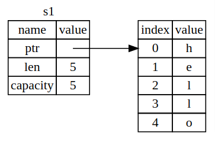
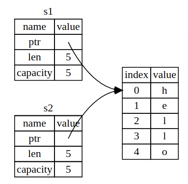

# Ownership

## Stack and Heap

All data stored on the stack must have a known, fixed size. Data with an unknown size at compile time or a size that might change must be stored on the heap instead. The heap is less organized: when you put data on the heap, you request a certain amount of space. The memory allocator finds an empty spot in the heap that is big enough, marks it as being in use, and returns a pointer, which is the address of that location.

Pushing to the stack is faster than allocating on the heap because the allocator never has to search for a place to store new data; that location is always at the top of the stack. Comparatively, allocating space on the heap requires more work, because the allocator must first find a big enough space to hold the data and then perform bookkeeping to prepare for the next allocation.

Accessing data in the heap is slower than accessing data on the stack because you have to follow a pointer to get there.

When your code calls a function, the values passed into the function (including, potentially, pointers to data on the heap) and the function’s local variables get pushed onto the stack. When the function is over, those values get popped off the stack.

**Keeping track of what parts of code are using what data on the heap, minimizing the amount of duplicate data on the heap, and cleaning up unused data on the heap so you don’t run out of space are all problems that ownership addresses.**

## Ownership rules

- Each value in Rust has a variable that’s called its `owner`.
- There can only be **one** owner at a time.
- When the owner goes out of scope, the value will be dropped.

## String Type

String type manages data allocated on the heap and as such is able to store an amount of text that is unknown to us at compile time

```rust
let l = "hello"; // string literal => immutable
let mut s = String::from("hello"); // String type => mutable
s.push_str(", world");
println!("{}", s);
```

When a variable goes out of scope, Rust calls a special function for us. This function is called `drop`. Rust calls drop automatically at the closing curly bracket.

## Ways Variables and Data Interact: Move

```rust
let x = 5;
let y = x; // x = 5, y = 5
```

Because integers are simple values with a known, fixed size, and these two 5 values are pushed onto the stack. So y = 5, x = 5

```rust
let s1 = String::from("hello");
let s2 = s1;
```



A String is made up of three parts, shown on the left: a pointer to the memory that holds the contents of the string, a length, and a capacity. This group of data is stored on the stack. On the right is the memory on the heap that holds the contents.

The `length` is how much memory, in bytes, the contents of the String is currently using. The `capacity` is the total amount of memory, in bytes, that the String has received from the allocator.

When we assign s1 to s2, the String data is copied, meaning we copy the pointer, the length, and the capacity that are on the stack. We do not copy the data on the heap that the pointer refers to.



Earlier, we said that when a variable goes out of scope, Rust automatically calls the drop function and cleans up the heap memory for that variable. But this is a problem: when s2 and s1 go out of scope, they will both try to free the same memory. This is known as a **double free error** and is one of the memory safety bugs we mentioned previously. Freeing memory twice can lead to memory corruption, which can potentially lead to security vulnerabilities.

To ensure memory safety, there’s one more detail to what happens in this situation in Rust. After let s2 = s1, Rust considers s1 to no longer be valid. Therefore, Rust doesn’t need to free anything when s1 goes out of scope.

```rust
let s1 = String::from("hello");
let s2 = s1;
println!("{}, world!", s1); // error since s1 is no longer valid
```

It sounds like a shallow copy while Rust will also invalidate the first variable. So instead of shallow copy, it's called `move`

## Ways Variables and Data Interact: Clone

If we do want to copy the heap (deep copy), we use `clone`

```rust
let s1 = String::from("hello");
let s2 = s1.clone();

println!("s1 = {}, s2 = {}", s1, s2);
```

Scalar Types don't have `move` since copy stack data is cheap. A tuple with all scalar types is also a scalar type, otherwise if it contains compound type, it's a compound type and `clone` is needed for deep copy

## Ownership and Functions

```rust
fn main() {
    let s = String::from("hello");  // s comes into scope
    takes_ownership(s);             // s's value moves into the function... and so is no longer valid here
    let x = 5;                      // x comes into scope
    makes_copy(x);                  // x would move into the function, but i32 is Copy, so it's okay to still use x afterward
} // Here, x goes out of scope, then s. But because s's value was moved, nothing special happens.

fn takes_ownership(some_string: String) { // some_string comes into scope
    println!("{}", some_string);
} // Here, some_string goes out of scope and `drop` is called. The backing
  // memory is freed.

fn makes_copy(some_integer: i32) { // some_integer comes into scope
    println!("{}", some_integer);
} // Here, some_integer goes out of scope. Nothing special happens.
```

```rust
fn main() {
    let s1 = gives_ownership();         // gives_ownership moves its return value into s1
    let s2 = String::from("hello");     // s2 comes into scope
    let s3 = takes_and_gives_back(s2);  // s2 is moved into takes_and_gives_back, which also moves its return value into s3
} // Here, s3 goes out of scope and is dropped. s2 was moved, so nothing happens. s1 goes out of scope and is dropped.

fn gives_ownership() -> String {             // gives_ownership will move its return value into the function that calls it
    let some_string = String::from("yours"); // some_string comes into scope
    some_string                              // some_string is returned and moves out to the calling function
}

// This function takes a String and returns one
fn takes_and_gives_back(a_string: String) -> String { // a_string comes into scope
    a_string  // a_string is returned and moves out to the calling function
}

```

## References and Borrowing

Define and a function that has a reference to an object as a parameter instead of taking ownership of the value:

```rust
fn main() {
    let s1 = String::from("hello");
    let len = calculate_length(&s1);
    println!("The length of '{}' is {}.", s1, len);
}

fn calculate_length(s: &String) -> usize {
    s.len()
}
```

What happens if we try to modify something we’re borrowing? => It will throw error

```rust
fn main() {
    let s = String::from("hello");
    change(&s);
}

fn change(some_string: &String) {
    some_string.push_str(", world"); // error: cannot borrow `*some_string` as  mutable
}
```

## Mutable References

```rust
fn main() {
    let mut s = String::from("hello");
    change(&mut s);
}

fn change(some_string: &mut String) {
    some_string.push_str(", world");
}
```

But mutable references have one big restriction: you can have only one mutable reference to a particular piece of data at a time. This code will fail:

```rust
let mut s = String::from("hello");
let r1 = &mut s;
let r2 = &mut s;

println!("{}, {}", r1, r2); // error: cannot borrow `s` as mutable more than once at a time
```

## Danging pointer is dangerous

```rust
fn dangle() -> &String { // dangle returns a reference to a String
    let s = String::from("hello"); // s is a new String
    &s // we return a reference to the String, s
} // Here, s goes out of scope, and is dropped. Its memory goes away. Danger!
```

## USize Type

If we have a type that does not have a definite size, we call those primitive types as `usize` in rust or dynamically sized types in rust.

```rust
let variable_name:usize = integer_value;
```

## Slice Type

### String Slice

A `string slice` is a reference to part of a String, and it looks like this:

```rust
let s = String::from("hello world");
let hello = &s[0..5]; // same to let hello = &s[..5];
let world = &s[6..11]; // same to let world = &s[6..];
```

The type that signifies “string slice” is written as `&str`

```rust
fn first_world(s: &String, t: char) -> &str {
  let bytes = s.as_bytes();
  for (i, &item) in bytes.iter().enumerate() {
    if item == t as u8 {
      return &s[..i];
    }
  }
  return &s[..];
}
```
