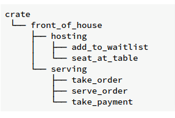
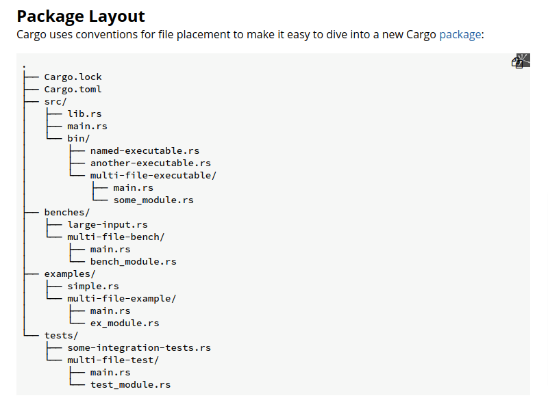

# Package, Crate and Modules

- **Packages**: A Cargo feature that lets you build, test, and share crates
- **Crates**: A tree of modules that produces a library or executable
- **Modules and use**: Let you control the organization, scope, and privacy of paths
- **Paths**: A way of naming an item, such as a struct, function, or module

## Defining Modules to Control Scope and Privacy

Create a lib

```bash
cargo new --lib restaurant
```

code of `./restaurant/src/lib.rs`

```rust
mod front_of_house {
  mod hosting {
      fn add_to_waitlist() {}
      fn seat_at_table() {}
  }

  mod serving {
      fn take_order() {}
      fn serve_order() {}
      fn take_payment() {}
  }
}
```

We define a module by starting with the `mod` keyword and then specify the name of the module (in this case, front_of_house) and place curly brackets around the body of the module. Inside modules, we can have other modules, as in this case with the modules hosting and serving



## Paths for Referring to an Item in the Module Tree

To show Rust where to find an item in a module tree, we use a `path` in the same way we use a path when navigating a filesystem. If we want to call a function, we need to know its path. Both absolute and relative paths are followed by one or more identifiers separated by `::`

```rust
mod front_of_house {
    mod hosting {
        fn add_to_waitlist() {}
    }
}

fn eat_at_restaurant() {
    // Absolute path
    crate::front_of_house::hosting::add_to_waitlist();
    // Relative path
    front_of_house::hosting::add_to_waitlist();
}
```

All items (functions, methods, structs, enums, modules, and constants) are private by default, so the code above will lead to a compile error: **error[E0603]: module `hosting` is private**. Using the `pub` keyword to make an item public.

```rust
mod front_of_house {
    pub mod hosting {
        fn add_to_waitlist() {}
    }
}

fn eat_at_restaurant() {
    // Absolute path
    crate::front_of_house::hosting::add_to_waitlist();
    // Relative path
    front_of_house::hosting::add_to_waitlist();
}
```

The above code still errors since `add_to_waitlist` function is still private.

```rust
mod front_of_house {
    pub mod hosting {
        pub fn add_to_waitlist() {}
    }
}
```

### Starting Relative Paths with `super`

We can also construct relative paths that begin in the parent module by using `super` at the start of the path. This is like starting a filesystem path with the .. syntax

```rust
fn serve_order() {}

mod back_of_house {
    fn fix_incorrect_order() {
        cook_order();
        super::serve_order();
    }

    fn cook_order() {}
}
```

The `fix_incorrect_order` function is in the `back_of_house` module, so we can use `super` to go to the parent module of `back_of_house`, which in this case is `crate`, the root. From there, we look for `serve_order` and find it.

### Making Structs and Enums Public

We can also use pub to designate structs and enums as public.

```rust
mod back_of_house {
    pub struct Breakfast {
        pub toast: String,
        seasonal_fruit: String, // this field is still private
    }

    impl Breakfast {
        pub fn summer(toast: &str) -> Breakfast {
            Breakfast {
                toast: String::from(toast),
                seasonal_fruit: String::from("peaches"),
            }
        }
    }
}

pub fn eat_at_restaurant() {
  // Order a breakfast in the summer with Rye toast
  let mut meal = back_of_house::Breakfast::summer("Rye");
  // Change our mind about what bread we'd like
  meal.toast = String::from("Wheat");
  println!("I'd like {} toast please", meal.toast);

  // The next line won't compile if we uncomment it; we're not allowed
  // to see or modify the seasonal fruit that comes with the meal
  // meal.seasonal_fruit = String::from("blueberries");
}
```

In contrast, if we make an enum public, all of its variants are then public.

```rust
mod back_of_house {
    pub enum Appetizer {
        Soup,
        Salad,
    }
}

pub fn eat_at_restaurant() {
    let order1 = back_of_house::Appetizer::Soup;
    let order2 = back_of_house::Appetizer::Salad;
}
```

## Bringing Paths into Scope with the `use` Keyword

```rust
mod front_of_house {
    pub mod hosting {
        pub fn add_to_waitlist() {}
    }
}

use crate::front_of_house::hosting;
// can aslo use a relative path
// use self::front_of_house::hosting;

pub fn eat_at_restaurant() {
    hosting::add_to_waitlist();
}
```

### use ... as ...

```rust
use std::fmt::Result;
use std::io::Result as IoResult;

fn function1() -> Result {
    // --snip--
}

fn function2() -> IoResult<()> {
    // --snip--
}
```

### Re-exporting Names with pub use

```rust
mod front_of_house {
    pub mod hosting {
        pub fn add_to_waitlist() {}
    }
}

pub use crate::front_of_house::hosting;

// By using pub use, external code can now call the add_to_waitlist function using hosting::add_to_waitlist
pub fn eat_at_restaurant() {
    hosting::add_to_waitlist();
}
```

### Using nested paths

```rust
use std::io;
use std::io::Write;

// same as this one
use std::io::{self, Write};
```

### Use glob

If we want to bring all public items defined in a path into scope, we can specify that path followed by `*`, the glob operator:

```rust
use std::collections::*;
```

This use statement brings all public items defined in std::collections into the current scope. Glob can make it harder to tell what names are in scope and where a name used in your program was defined. The glob operator is often used when testing to bring everything under test into the tests module

## Separating Modules into Different Files

Using a semicolon after mod front_of_house rather than using a block tells Rust to load the contents of the module from another file with the same name as the module.

### Cargo Package Layout


